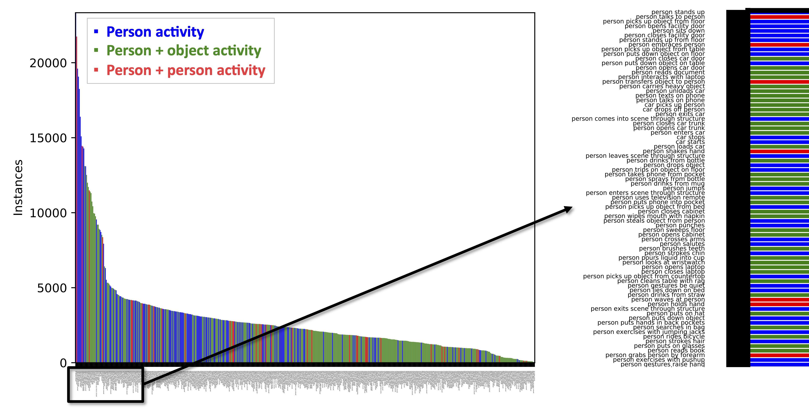
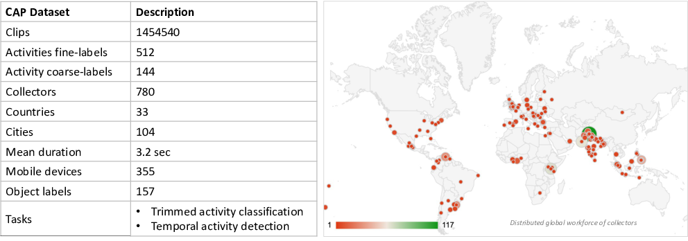

# Overview

The [Consented Activities of People (CAP) dataset](https://github.com/visym/cap) is a fine grained activity dataset for visual AI research curated using the [Visym Collector](https://visym.com/collector) platform.  The CAP dataset contains annotated videos of [fine-grained activity classes](https://github.com/visym/cap/blob/main/classification/cap_labels.csv) of consented people.   Videos are recorded from mobile devices around the world from a third person viewpoint looking down on the scene from above, containing subjects performing every day activities.  Videos are annotated with bounding box tracks around the primary actor along with temporal start/end frames for each activity instance, and distributed in [vipy](https://visym.github.io/vipy) json format.  An interactive visualization and video summary is available for review below.  

The CAP dataset was collected with the following goals:

* **Atomic.** Activities have length ≤ 3 seconds and visually grounded (e.g. activities should be unambiguously determined from the pixels).  
* **Fine-grained.**  All activities are selected so that there are subtle differences between classes where the activity representation and discrimination is critical for performance, rather than the scene context or object detection.  The label space of fine-grained activities is [tree structured](https://github.com/visym/cap/blob/main/classification/superlabel.pdf) by design.
* **Person centered.**  All activities are collected from handheld or stabilized mobile devices at a fixed security perspective (e.g. looking down on a scene from above) and include a single consented person as the primary subject.  Subjects are tasked with performing specific atomic activities, person/object or person/person interactions.  
* **Around the house.**  The collection involves objects, locations and activities that most collectors have easy access to and can easily perform without practice.
* **Non-overlapping.**  All activities are performed independently, and no activities are performed jointly or simultaneously overlapping with other activities (e.g. a subject will not simultaneously perform the “person uses cell phone” activity while performing the “person takes off hat” activity). 
* **Ethical.**  All videos are collected with informed consent for how the videos will be shared and used.  Non-consented subjects have their faces blurred. 
* **Worldwide.**  Videos are collected from 780 collectors in 33 countries. 
* **Large-scale.**  We provide an open and easily downloaded training/validation set suitable for pre-training.  

This dataset is associated with the:

* [First Workshop on Fine-grained Activity Detection](https://openfad.nist.gov/workshop/fgad23) at [WACV'23](https://wacv2023.thecvf.com/node/138) in January 2023
* [Second Workshop on Fine-grained Activity Detection](https://openfad.nist.gov/workshop/iccv_fgad23) at [ICCV'23](https://iccv2023.thecvf.com/list.of.accepted.workshops-363300-4-31-33.php) in October 2023.  

## Explorer

<iframe src="https://htmlpreview.github.io/?https://github.com/visym/cap/blob/main/docs/cap_hoverpixel_selector_56K.html" style="width: 1280px; height: 768px; border: 0px;" allowfullscreen></iframe>

The dataset explorer shows a 4% sample of the CAP dataset, tightly cropped spatially around the actor and cropped temporally around the fine-grained activity being performed.  The full dataset includes the larger spatiotemporal context in each video around the activity, and the complete set of [activity labels](https://github.com/visym/cap/blob/main/classification/superlabel.pdf).  This [open source visualization tool](https://github.com/visym/vipy/blob/master/vipy/visualize.py#L20-L51) can be sorted by category or color, and shown in full screen.

## Visualization

<iframe width="1280" height="768" src="https://www.youtube.com/embed/Je91vWjSHpo" title="Fine-grained Activities of Consented People" frameborder="0" allow="accelerometer; autoplay; clipboard-write; encrypted-media; gyroscope; picture-in-picture" allowfullscreen></iframe>

This video visualization shows a sample of 40 activities each from 28 collectors showing the tight crop around the actor.  We also provide visualization of a random sample of [full context videos](https://youtu.be/KvULvetOV8c) available in the training/validation set and [5Hz background stabilized](https://youtu.be/Iyo4fRLR65Q) videos.  

## Summary

This summary shows the statistics of the entire CAP dataset which includes activity classification and activity detection subsets as well as sequestered test sets.  The public training/validation sets for specific tasks will be smaller than these totals.  

## Download

* [cap_classification_clip.tar.gz](https://consented-activities-of-people.s3.us-west-2.amazonaws.com/train/cap_classification_clip.tar.gz) (288 GB)&nbsp;&nbsp;MD5:54315e2ce204f0dbbe298490a63b5b3b&nbsp;&nbsp;(02Mar22)
    * Tight temporal clip training/validation set for handheld activity classification
* [cap_classification_pad.tar.gz](https://consented-activities-of-people.s3.us-west-2.amazonaws.com/train/cap_classification_pad.tar.gz) (386 GB)&nbsp;&nbsp;MD5:fbdc75e6ef10b874ddda20ee9765a710&nbsp;&nbsp;(02Mar22)
    * Temporally padded (&gt;4s) training/validation set for handheld activity classification
* [cap_detection_handheld_val.tar.gz](https://dl.dropboxusercontent.com/s/db11zv0gcycu384/cap_detection_handheld_val.tar.gz.72f58e69582c17dd366d3c7e85cf0da8) (0.9 GB)&nbsp;&nbsp;MD5:72f58e69582c17dd366d3c7e85cf0da8&nbsp;&nbsp;(05May23)
    * Validation set for handheld activity detection in untrimmed clips

<!--
* cap_classification_pad_stabilized.tar.gz (XXX GB)&nbsp;&nbsp;MD5:XXXX&nbsp;&nbsp;
    * [Background stabilized](https://github.com/visym/vipy/blob/master/vipy/video.py#L3972-L3996) temporally padded (&gt;4s) training/validation set
-->

## License

Creative Commons Attribution 4.0 International [(CC BY 4.0)](https://creativecommons.org/licenses/by/4.0/).  Every subject in this dataset has consented to their personally identifable information to be shared publicly for the purpose of advancing computer vision research.  Non-consented subjects have their faces blurred out.  

## Reference

Jeffrey Byrne [(Visym Labs)](https://visym.com), Greg Castanon [(STR)](https://str.us), Zhongheng Li [(STR)](https://str.us) and Gil Ettinger [(STR)](https://str.us)  
"Fine-grained Activities of People Worldwide", [arXiv:2207.05182](https://arxiv.org/abs/2207.05182), 2022

> @article{Byrne2023Fine,  
> &nbsp;&nbsp; title = "Fine-grained Activities of People Worldwide",  
> &nbsp;&nbsp; author = "J. Byrne and G. Castanon and Z. Li and G. Ettinger",  
> &nbsp;&nbsp; journal = "Winter Applications of Computer Vision (WACV'23)",  
> &nbsp;&nbsp; year = 2023   
> }  

# Acknowledgement

Supported by the Intelligence Advanced Research Projects Activity (IARPA) via Department of Interior/ Interior Business Center (DOI/IBC) contract number D17PC00344. The U.S. Government is authorized to reproduce and distribute reprints for Governmental purposes notwithstanding any copyright annotation thereon. Disclaimer: The views and conclusions contained herein are those of the authors and should not be interpreted as necessarily representing the official policies or endorsements, either expressed or implied, of IARPA, DOI/IBC, or the U.S. Government.

We thank the [AWS Open Data Sponsorship Program](https://registry.opendata.aws/visym-cap) for supporting the storage and distribution of this dataset.

# Contact

Visym Labs <a href="mailto:info@visym.com">&lt;info@visym.com&gt;</a>

